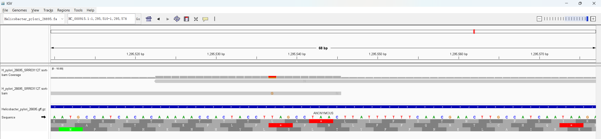

# Week 5: Generate a BAM File

## Data Used

This assignment builds on the previous two data assignments.

Reference genome from Week 2:

```text
../week02/fasta/Helicobacter_pylori_26695.fa
```

FASTQ reads from Week 4:

```text
../week04/reads/trimmed/H_pylori_26695_SRR031127.trimmed.fastq
```

The reference genome is the complete RefSeq genome of **Helicobacter pylori 26695**:

- Assembly: `GCF_000008525.1_ASM852v1`
- Genome size: `1,667,867 bp`
- Genome type: complete bacterial genome
- Chromosomes/scaffolds: `1`

The sequencing data used here is **not genomic DNA WGS**. The run `SRR031127` is Illumina/Solexa single-end transcriptomic data. SRA metadata describes it as:

- Platform: `Illumina`
- Layout: `single-end`
- Source: `TRANSCRIPTOMIC`
- Library: `AS-Lib`
- Sample: total RNA from _H. pylori_ 26695 under acid stress

## Aligner Choice

Because _H. pylori_ is a bacterium, its genome is small and does not have the intron-rich transcript structure found in eukaryotes. These RNA-derived short reads can therefore be aligned directly to the bacterial genome FASTA.

Possible aligners include `bwa mem`, `bowtie2`, and `minimap2`. `bwa mem` and `bowtie2` are appropriate for Illumina short reads, while `minimap2` is better suited for long-read data such as Nanopore or PacBio. If this were eukaryotic RNA-seq, a splice-aware aligner such as `STAR` or `HISAT2` would be more appropriate.

For this assignment I used:

```text
bwa mem
```

This is appropriate for the selected Illumina/Solexa short reads, and it is available in the course pixi environment together with `samtools`.

## How N Was Estimated

For ordinary genomic DNA reads, the approximate number of reads needed for 10x coverage is:

```text
N = coverage * genome_size / read_length
```

Using the Week 2 genome size and Week 4 read length:

```text
N = 10 * 1,667,867 / 76
N = 219,456 reads
```

So about `220,000` retained 76 bp reads would be needed for 10x genome-wide coverage if this were genomic DNA sequencing.

However, `SRR031127` is transcriptomic data. Coverage is expected to follow expressed genes rather than be uniform across the genome. Therefore this calculation is useful as a scale estimate, but it does not guarantee uniform genome coverage for this dataset.

For validation, I used the small Week 4 test subset generated with:

```bash
pixi run -m "$HOME/edu/bioinfo" make -C week04 all N=200
```

After `fastp`, that subset contained `89` reads.

## Reproduce the BAM Workflow

Run from this directory:

```bash
pixi run -m "$HOME/edu/bioinfo" make all
```

The Makefile performs these steps:

1. Index the reference FASTA with `bwa index`.
2. Align the trimmed FASTQ reads with `bwa mem`.
3. Sort the alignment with `samtools sort`.
4. Create a BAM index with `samtools index`.
5. Generate `flagstat`, `idxstats`, and coverage reports.

Main output files:

```text
bam/H_pylori_26695_SRR031127.sorted.bam
bam/H_pylori_26695_SRR031127.sorted.bam.bai
reports/H_pylori_26695_SRR031127.flagstat.txt
reports/H_pylori_26695_SRR031127.idxstats.txt
reports/H_pylori_26695_SRR031127.coverage_summary.tsv
```

The BAM file and full per-base coverage table are generated locally but not committed to GitHub.

## Alignment Results

From `samtools flagstat`:

```text
89 reads total
53 reads mapped
59.55% mapped
```

From `samtools idxstats`:

```text
NC_000915.1    1667867    53    0
*              0          0     36
```

From the coverage summary:

```text
genome_bp          1667867
covered_bp         2909
covered_fraction   0.00174414
mean_depth         0.00214525
```

## What the Alignments Look Like

The aligned reads map to the single _H. pylori_ chromosome `NC_000915.1`. Example alignments include full-length `76M` matches as well as some reads with soft clipping or mismatches. This is reasonable for a tiny transcriptomic subset.

Because these reads are transcriptomic, the coverage is not uniform. Only a small fraction of the genome is covered in the `N=200` validation subset, and reads are expected to concentrate in expressed regions rather than cover the genome evenly.

## IGV Visualization

To view the BAM in IGV:

1. Load the Week 2 genome FASTA:

```text
../week02/fasta/Helicobacter_pylori_26695.fa
```

2. Load the sorted BAM:

```text
week05/bam/H_pylori_26695_SRR031127.sorted.bam
```

3. Optionally also load the Week 2 annotation track:

```text
../week02/gff/Helicobacter_pylori_26695.gff.gz
```

Add the IGV screenshot here:

```markdown

```
