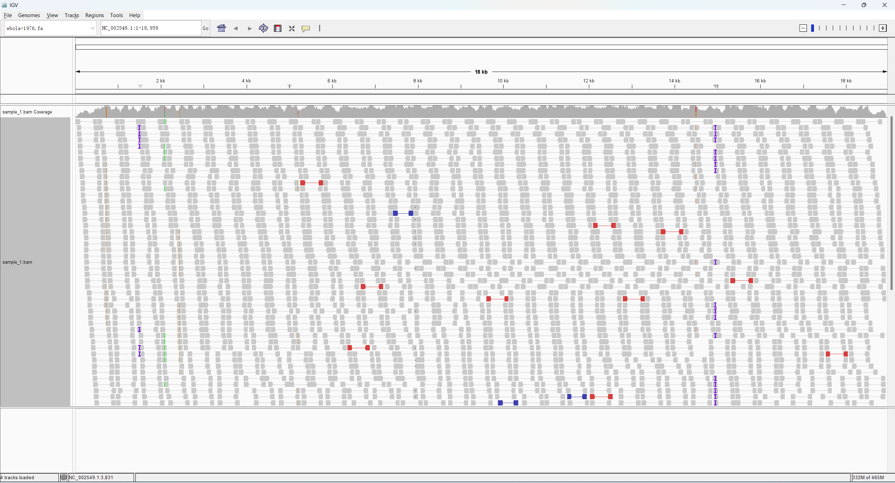
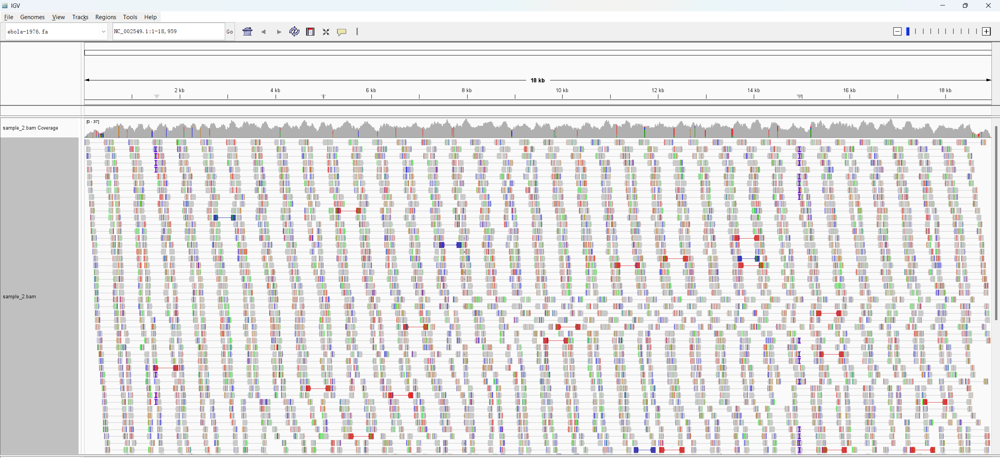
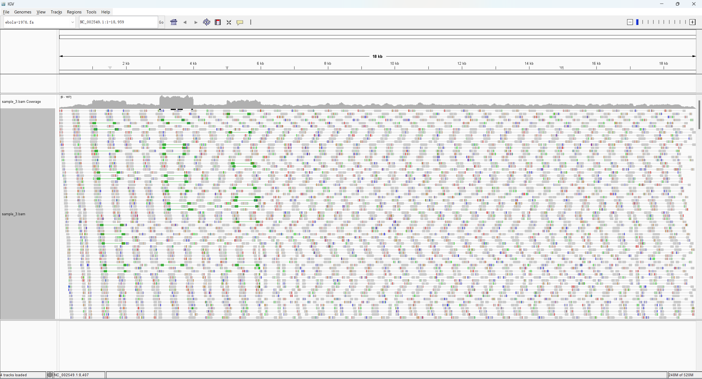
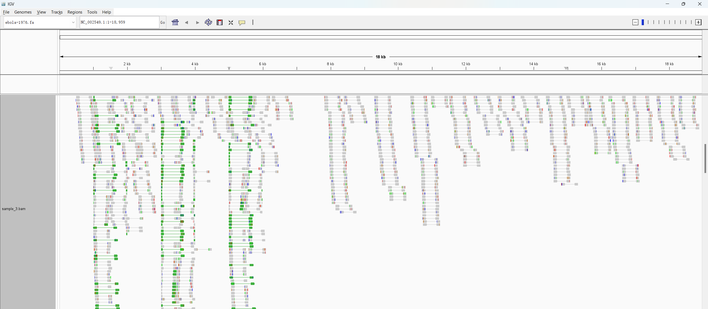
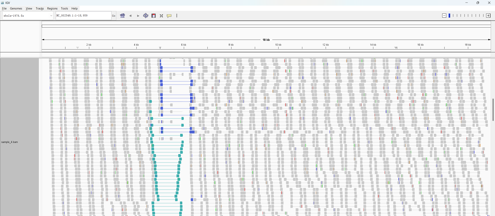
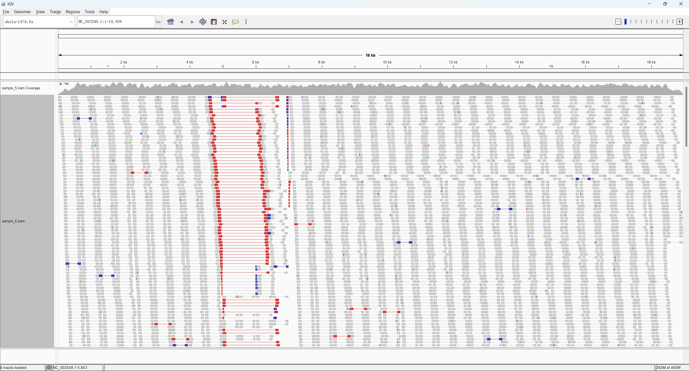

# Week 6: Evaluate Structural Variants

Structural variants are large changes relative to the reference genome, such as
insertions, deletions, inversions, translocations, fusions, and copy-number
changes. In short-read alignments, most reads are not informative for structural
variation because they align entirely within one continuous region. The most
informative reads are the small number of reads or read pairs that cross over a
variant junction.

Paired-end reads are useful because the two ends of a DNA fragment connect more
distant regions of the genome. Their span and orientation can indicate the type
of structural variation. Normal paired-end reads usually point toward each other
with an expected insert size. A deletion relative to the reference may produce a
**coverage gap** and read pairs with a larger-than-expected insert size. A short
insertion may produce smaller apparent insert sizes, while a larger insertion may
leave orphan reads whose mate cannot align. If a region is inverted or
rearranged, read pairs may point in the same direction or away from each other.

## Data

Reference genome loaded in IGV with `Genomes -> Load Genome from URL`:

```text
https://data.biostarhandbook.com/courses/2026-appbio/igv/fasta/ebola-1976.fa
```

BAM files loaded in IGV with `File -> Load from URL`:

```text
https://data.biostarhandbook.com/courses/2026-appbio/igv/bam/sample_1.bam
https://data.biostarhandbook.com/courses/2026-appbio/igv/bam/sample_2.bam
https://data.biostarhandbook.com/courses/2026-appbio/igv/bam/sample_3.bam
https://data.biostarhandbook.com/courses/2026-appbio/igv/bam/sample_4.bam
https://data.biostarhandbook.com/courses/2026-appbio/igv/bam/sample_5.bam
```

## IGV Settings

I inspected the BAM files one sample at a time to avoid mixing signals between
samples. For each sample, I used these IGV settings:

- `One View as pairs Color alignments by -> insert size`
- `Two View as pairs Color alignments by -> pair orientation`

The main visual signals I looked for were:

- Coverage drop: possible deletion.
- Coverage increase: possible duplication.
- Abnormally large insert size: possible deletion relative to the reference.
- Abnormally small insert size: possible insertion relative to the reference.
- Unusual paired-end orientation: possible inversion or rearrangement.
- Soft-clipped or split reads near the same coordinate: possible breakpoint.

For the screenshots in this assignment, I mainly used two types of IGV evidence:
coverage changes and paired-end read patterns. Coverage changes help distinguish
copy-number changes, such as deletions and duplications. Paired-end insert size,
orientation, and repeated split or insertion marks help identify local
breakpoints, inversions, and smaller insertions.

## Sample 1



Sample 1 appears to contain a small insertion relative to the reference genome.
Multiple independent reads show an insertion mark (`I`) at the same genomic
position, giving consistent read-level support for a localized insertion event.

The rest of the genome has relatively normal coverage and alignment patterns.
There is no obvious large coverage loss or gain across the genome, so the main
signal is a small local insertion rather than a large deletion, duplication, or
other broad structural rearrangement.

This conclusion is based on repeated IGV insertion marks at the same location. A
variant caller would be needed to report the exact inserted sequence and formal
genotype.

## Sample 2



Sample 2 shows extensive sequence divergence from the reference genome. Many
colored mismatch bases are distributed across nearly the entire genome instead
of being concentrated at one small locus.

Coverage is still present across most of the reference, so the sample is still
similar enough to align to the Ebola reference. However, the genome-wide density
of mismatches suggests a highly divergent strain or viral lineage rather than a
single localized structural variant.

## Sample 3





Sample 3 most likely contains a tandem duplication. In the whole-genome view, a
specific region has noticeably increased read coverage compared with the
surrounding genome, which suggests increased copy number.

In the detailed paired-read view, many read pairs in and around this region have
abnormal pair orientations. The combination of increased coverage and abnormal
orientation supports a duplication more strongly than a simple inversion,
because an inversion would usually preserve copy number.

## Sample 4



Sample 4 most likely contains an inversion. When reads are viewed as pairs and
grouped by pair orientation, many read pairs around the same region show
abnormal orientations.

Unlike a deletion or duplication, this sample does not show an obvious large
coverage drop or coverage increase in the affected region. The visual pattern is
therefore most consistent with a segment that is still present but reversed
relative to the reference genome.

## Sample 5



Sample 5 most likely contains a large translocation.
